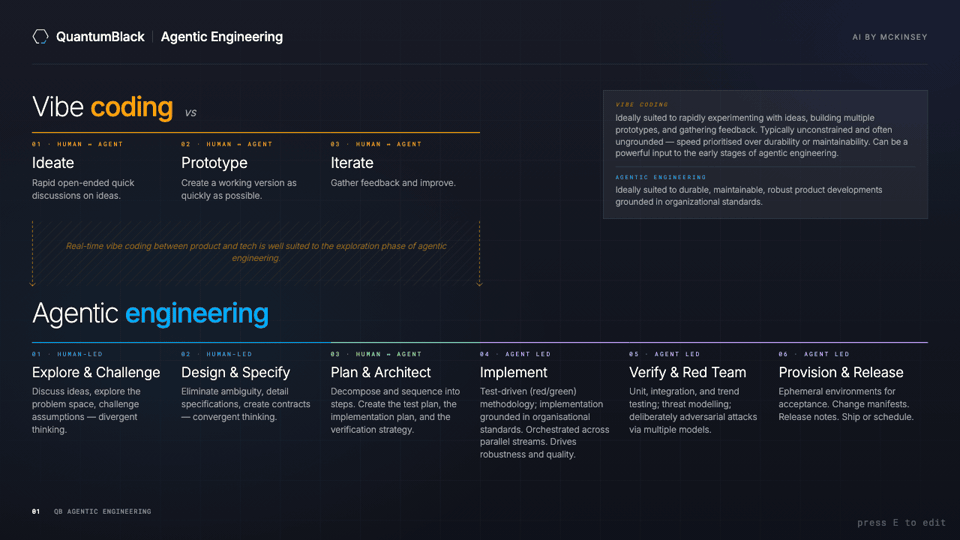
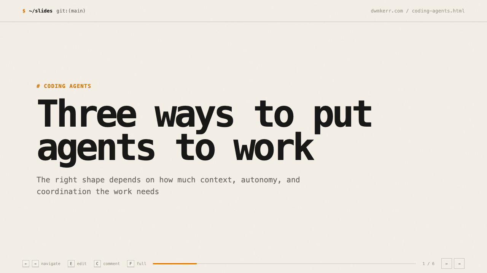
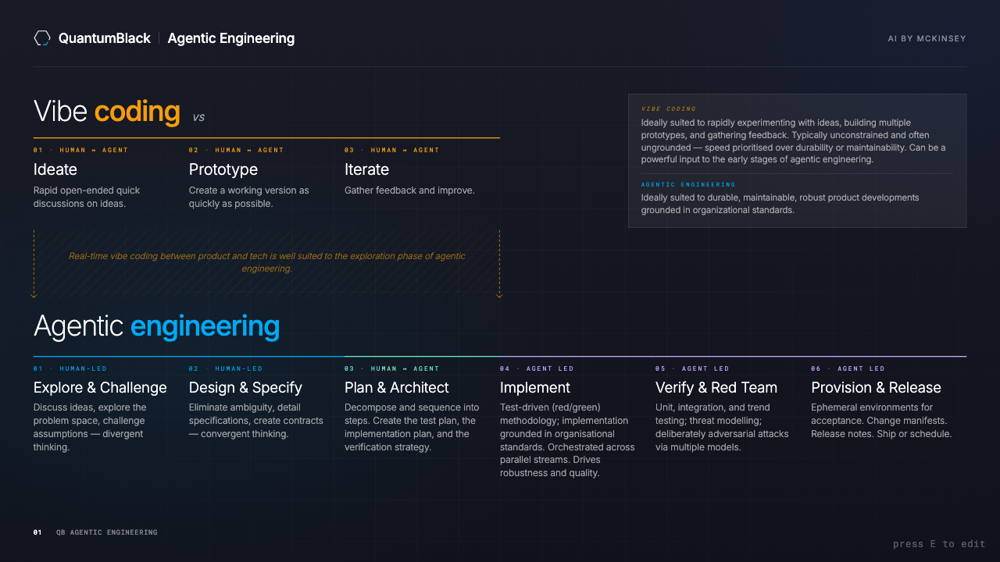

<a href="https://dwmkerr.github.io/slides/demo-slides/"></a>

# slides

Hand-built HTML presentations that coding agents can create, present, and edit with you.

## Install

```sh
npx skills add dwmkerr/slides
```

## Try it out

> **Prompt:** Create slides in the dwmkerr.com style that present three options for coding agents

## Examples

### dwmkerr.com

<a href="https://dwmkerr.github.io/slides/demo-slides/"></a>

### Conference

<a href="https://dwmkerr.github.io/slides/conference/"></a>

### QuantumBlack-inspired

<a href="https://dwmkerr.github.io/slides/quantumblack/"></a>

- Dependency-free, hand-built HTML
- `dwmkerr.com`, conference, and QuantumBlack-inspired styles
- Arrow-key navigation, progressive reveals, fullscreen, notes, and teleprompter view
- Press `E` to edit, `C` to comment, and live-save while the deck is served

## Edit together

To preview or edit a deck, ask:

> Serve the slides

or “Make the slides editable.” In edit mode, the toolbar shows whether live-save is connected and warns clearly if it disconnects.

## See also

- [Interactive template gallery](https://dwmkerr.github.io/slides/)
- [AI Native DevCon conference deck](https://dwmkerr.github.io/slides/conference/) and [recorded talk](https://www.youtube.com/watch?v=ACL7_EsfIio)
- [More tools and skills by dwmkerr](https://skills.sh/dwmkerr)
- [claude-toolkit](https://github.com/dwmkerr/claude-toolkit), the original home of this skill

This standalone project starts at `v0.1.6`, inherited from [claude-toolkit v0.1.6](https://github.com/dwmkerr/claude-toolkit/tree/v0.1.6/plugins/dwmkerr/skills/slides).

## Developer guide

Install the current checkout globally, then invoke it in Claude Code:

```sh
npx skills add . --global --agent claude-code --yes
```

```text
/slides build me a deck comparing coding agent harnesses
```

Run the install command again after source changes because the checkout is copied. Claude Code hot-reloads standalone skills; use `/reload-skills` only if needed. No version bump or `/reload-plugins` is required.

## Attribution

The QuantumBlack-inspired style is an unofficial approximation based only on publicly available material. It is not a QuantumBlack or McKinsey brand guide, product, or endorsement. No internal, confidential, client, or proprietary presentation content is included. Use of a style for an external work-related presentation does not make these templates official work assets; users remain responsible for permissions for anything they add.

[MIT](./LICENSE) © Dave Kerr
